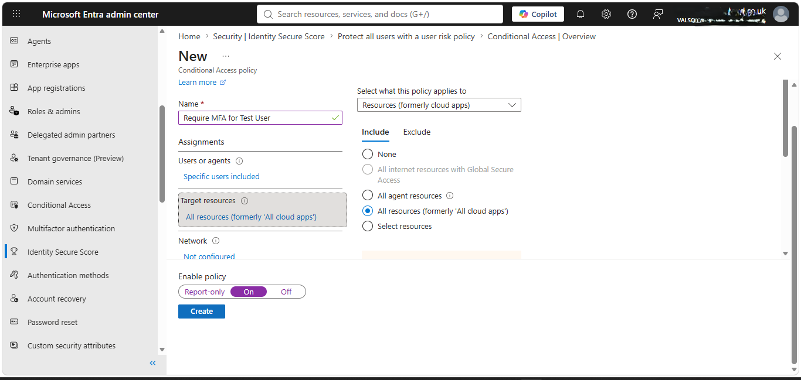
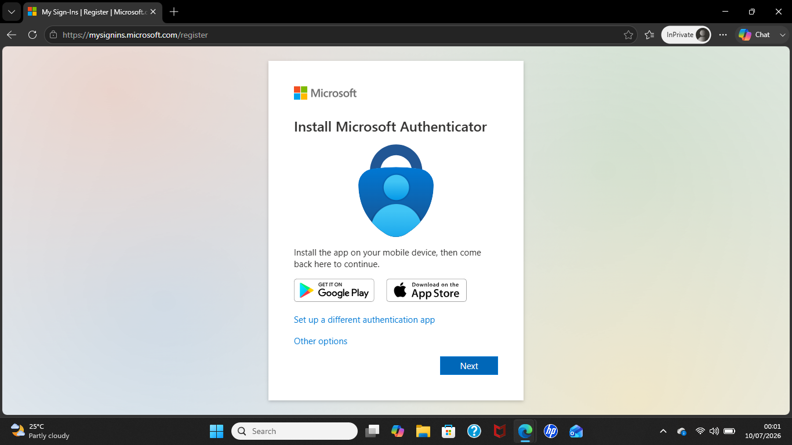
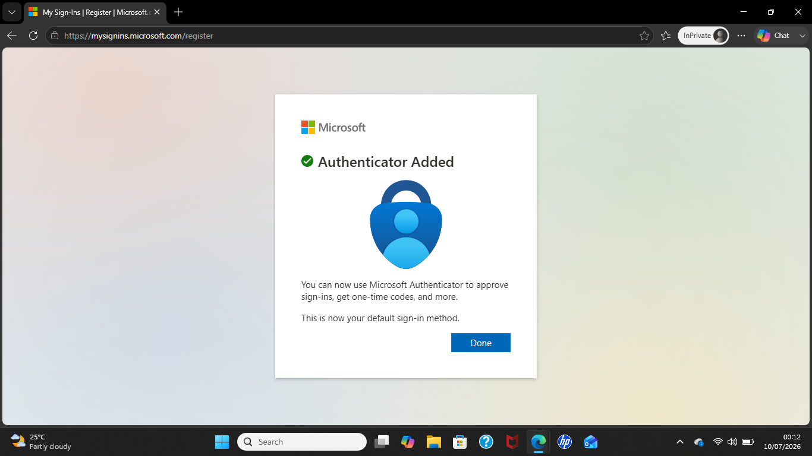
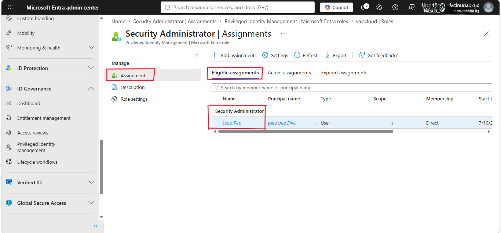
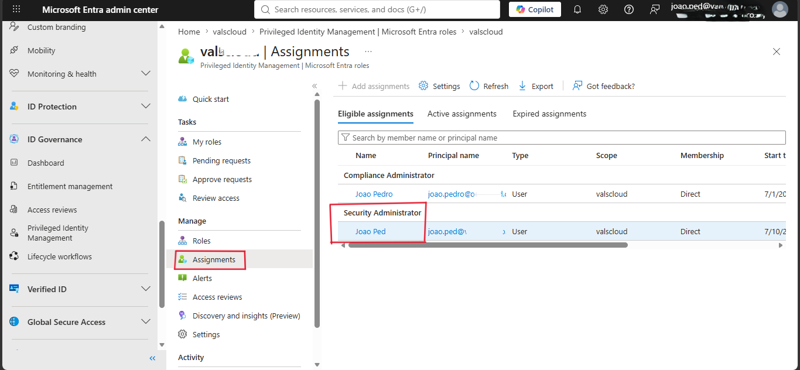

# My Notes — UGONMA AJIE

---

## Key Concepts I Learned

- Microsoft Entra ID is Microsoft's Identity and Access Management (IAM) solution used to secure users and organizational resources.
- Identity is a key layer in Microsoft's Defense in Depth security strategy.
- Multi-Factor Authentication (MFA) helps protect accounts even if passwords are compromised.
- Security Defaults provide baseline security for every Microsoft Entra tenant.
- Conditional Access uses **If...Then...** logic to control access based on conditions such as user, device, location, or risk.
- Before implementing Conditional Access policies, organizations should have a deployment strategy to avoid disrupting users.
- Privileged Identity Management (PIM) reduces standing administrator access by providing just-in-time privileged access.

---

## Lab / Hands-On Work

### What I did

#### Task 1 – Created a Conditional Access Policy
- Created a Conditional Access policy named **Require MFA for Test User**.
- Configured the policy to require Multi-Factor Authentication for a selected user when accessing cloud applications.
- Reviewed the policy after it was successfully created.

– Configured Multi-Factor Authentication (MFA)
- Verified that MFA was required during sign-in.

---

#### Task 2 – Explored Privileged Identity Management (PIM)
- Explored Microsoft Entra Privileged Identity Management.
- Reviewed eligible and active role assignments to understand just-in-time administrator access.

---

### What happened / Result

- Successfully created a Conditional Access policy to strengthen sign-in security.
- Configured MFA to provide an additional layer of authentication.
- Learned how PIM limits permanent administrator privileges and improves security through temporary role activation.

---

### Challenges I faced

- Understanding the difference between Security Defaults and Conditional Access.
- Learning how Conditional Access policies should be planned before deployment to prevent user lockouts.

---

## My Takeaways

- Identity is one of the most important security boundaries in cloud environments.
- MFA is one of the most effective ways to protect user accounts.
- Conditional Access allows organizations to enforce security based on specific conditions.
- PIM helps organizations follow the principle of least privilege by reducing standing administrator access.

---

## Resources I Found Useful

- Microsoft Learn
- GitHub

---

*Submitted by: Ugonma Ajie · GitHub: UgonmaAjie

---
